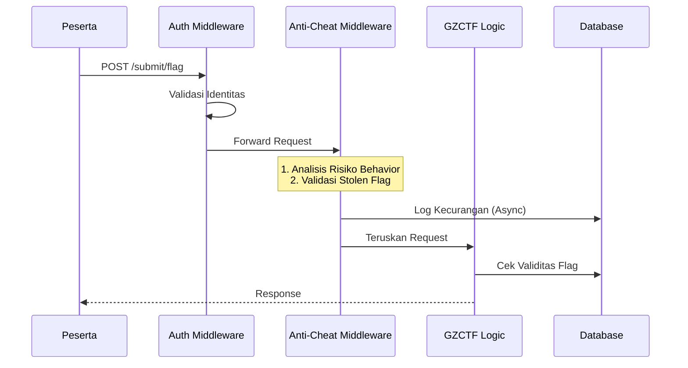

  

    <!-- Tag -->
    

      Proposal Skripsi
    

    <!-- Title -->
    

      PERANCANGAN SISTEM PENDETEKSI  
      KECURANGAN 
      PADA KOMPETISI CYBER SECURITY
    

    

      MENGGUNAKAN ALGORITMA TWO-STAGE SIMILARITY ANALYSIS 
      DAN WEIGHTED RISK SCORING
    

    

    <!-- Author & Inst info -->
    

        
        

            
Dimas Maulana

            
2215354026

            
D4 Teknologi Rekayasa Perangkat Lunak

        

    

  

---
layout: default
title: Latar Belakang
---

# Latar Belakang

  

    

      
Evolusi Pendidikan Siber

      
Pergeseran dari pembelajaran teori ke <b>Hands-on</b> melalui kompetisi CTF (Capture The Flag).

    

    

      
Masalah Integritas

      
Kecurangan (Flag Sharing, Kolusi, Joki) mencederai nilai akademik dan sportivitas.

    

  

  

    

      
Keterbatasan Saat Ini

      <ul class="list-disc pl-4 opacity-90 space-y-0.5 text-xs">
        <li>Deteksi manual via log (tidak efisien).</li>
        <li>Kurangnya korelasi data otomatis.</li>
        <li>Fitur GZCTF terbatas pada log submission mentah.</li>
      </ul>
    

    

      
"Tanpa sistem deteksi otomatis, penyelenggara mengandalkan pemeriksaan manual yang rentan human error."

    

  

---
layout: default
---

# Solusi yang Diusulkan

Membangun **Middleware Deteksi Kecurangan** pada GZCTF dengan pendekatan hibrida:

  

   
🔍

   <h3 class="font-bold text-sm mb-1 text-teal-600">Sequence Analysis</h3>
   
LCS & Jaccard Index untuk mendeteksi kesamaan pola pengerjaan soal.

  

  

   
🕸️

   <h3 class="font-bold text-sm mb-1 text-teal-600">Confidence Screening</h3>
   
Algoritma CSD untuk memvalidasi kelompok kolusi (Collusion Groups).

  

  

   
⚖️

   <h3 class="font-bold text-sm mb-1 text-teal-600">Weighted Risk Scoring</h3>
   
Skor risiko terintegrasi dari berbagai anomali (IP, Waktu, Fingerprint).

  

---

# Rumusan Masalah

  

    

      
1

      
Arsitektur Middleware

    

    
Bagaimana merancang arsitektur middleware yang efektif tanpa mengorbankan performa?

  

  
  

    

      
2

      
Sequence Similarity

    

    
Bagaimana mekanisme implementasi <i>Sequence Similarity Analysis</i> untuk deteksi kolusi?

  

  

    

      
3

      
Risk Scoring

    

    
Bagaimana merumuskan model <i>Weighted Risk Scoring</i> yang optimal?

  

  

    

      
4

      
Akurasi Sistem

    

    
Seberapa besar tingkat akurasi sistem dibandingkan metode manual?

  

---

# Tujuan Penelitian

  

 <h3 class="font-bold text-sm text-teal-700  mb-0.5">Modul Middleware</h3>
 
Membangun modul deteksi terintegrasi dengan ASP.NET Core GZCTF.

  

  

 <h3 class="font-bold text-sm text-teal-700  mb-0.5">Algoritma Similarity</h3>
 
Implementasi LCS + Jaccard dan validasi CSD.

  

  

 <h3 class="font-bold text-sm text-teal-700  mb-0.5">Risk Scoring</h3>
 
Sistem pelabelan tingkat kecurigaan otomatis berbasis bobot.

  

  

 <h3 class="font-bold text-sm text-teal-700  mb-0.5">Evaluasi Performa</h3>
 
Validasi menggunakan metrik Presisi, Recall, dan F1-Score.

  

---

# Kerangka Teori

Beberapa konsep kunci yang menjadi landasan penelitian:

 

  
GZCTF Framework

  
Platform CTF open-source berbasis ASP.NET Core dengan arsitektur modular yang mendukung injeksi middleware.

 

 

  
Jaccard Similarity

  
Mengukur kesamaan himpunan soal yang diselesaikan tanpa memandang urutan.

 

 

  
Longest Common Subsequence (LCS)

  
Mendeteksi kesamaan urutan kronologis penyelesaian soal untuk indikasi mencontek "step-by-step".

 

 

  
Weighted Risk Scoring

  
Agregasi berbagai indikator anomali (Shared IP, Fast Solve, dll) menjadi satu skor risiko terukur.

 

---

# Metodologi Penelitian

Pendekatan **Waterfall** untuk pengembangan sistem terstruktur.

  <!-- Line connecting nodes -->
  

  

    
1

    
Analisis Kebutuhan

  

  

    
2

    
Perancangan Sistem

  

  

    
3

    
Implementasi

  

  

    
4

    
Pengujian

  

  

    
5

    
Evaluasi

  

---
layout: center
---

# Arsitektur Sistem

Middleware ditempatkan di antara Autentikasi dan Logika Bisnis Utama.

---

# Skenario Pengujian

Validasi sistem melalui berbagai skenario serangan dan anomali.

<table class="premium-table w-full text-xs">
  <thead>
    <tr>
      <th class="py-2 px-3">Kode</th>
      <th class="py-2 px-3">Skenario</th>
      <th class="py-2 px-3">Ekspektasi</th>
    </tr>
  </thead>
  <tbody>
    <tr v-click class="group">
      <td class="font-mono text-teal-600 font-bold group-hover:scale-110 transition-transform origin-left py-2 px-3">TA-01</td>
      <td class="py-2 px-3">Stolen Flag</td>
      <td class="py-2 px-3">Block Request (403) + Log Critical</td>
    </tr>
    <tr v-click class="group">
      <td class="font-mono text-teal-600 font-bold group-hover:scale-110 transition-transform origin-left py-2 px-3">TA-02</td>
      <td class="py-2 px-3">Flag Sharing (>90% similarity)</td>
      <td class="py-2 px-3">Detect Collusion Group</td>
    </tr>
    <tr v-click class="group">
      <td class="font-mono text-teal-600 font-bold group-hover:scale-110 transition-transform origin-left py-2 px-3">TA-04</td>
      <td class="py-2 px-3">Burst Solve (5 flags/10s)</td>
      <td class="py-2 px-3">Risk Score +30</td>
    </tr>
    <tr v-click class="group">
      <td class="font-mono text-teal-600 font-bold group-hover:scale-110 transition-transform origin-left py-2 px-3">TA-11</td>
      <td class="py-2 px-3">Fast Solve (<2 min)</td>
      <td class="py-2 px-3">Risk Score +50</td>
    </tr>
    <tr v-click class="group">
      <td class="font-mono text-teal-600 font-bold group-hover:scale-110 transition-transform origin-left py-2 px-3">Perf</td>
      <td class="py-2 px-3">Load Test (50 concurrent)</td>
      <td class="py-2 px-3">Latency &lt; 300ms</td>
    </tr>
  </tbody>
</table>

---
layout: end
---

# Terima Kasih

Sesi Tanya Jawab

  

